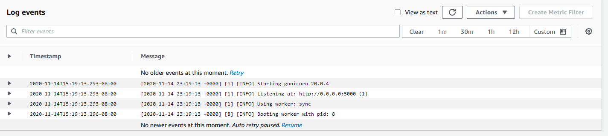
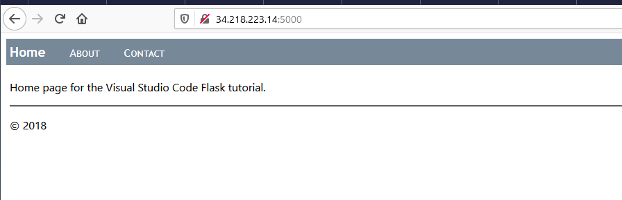

# hello-fargate
Playing around with fargate

**note** If following the tutorial, I've left out some files that contain account specific information. You'll have to follow at your own discretion. 

https://docs.aws.amazon.com/AmazonECS/latest/developerguide/ecs-cli-tutorial-fargate.html

## Setup the ECS CLI
https://docs.aws.amazon.com/AmazonECS/latest/developerguide/ECS_CLI_installation.html

https://docs.aws.amazon.com/AmazonECS/latest/developerguide/ECS_CLI_Configuration.html

`ecs-cli configure --cluster fargateTutorial --default-launch-type FARGATE --config-name fargateTutorial --region us-west-2`

`ecs-cli configure profile --access-key <ACCESS_KEY> --secret-key <SECRET_KEY> --profile-name tutorial-profile`

## Setup the AWS CLI
https://docs.aws.amazon.com/cli/latest/userguide/install-cliv2-linux.html

## Setup Environment (VSCode)
`python3 -m venv env`

`cntrl+shift+p` select python interpreter from `./env`

new terminal to activate the env

`pip3 install flask`

`pip3 install gunicorn`

`pip freeze > requirements.txt` to setup requirements

In the future, simply setup the environment, select interpreter and use requirements.txt to install all requirements.

## Run the App from Terminal
from the hello_app folder... `python3 -m flask run`

## Setup the Docker Image

`docker build --tag kvnsmith212/hellofargate:latest .`

`docker push kvnsmith212/hellofargate:latest`

Public image: https://hub.docker.com/repository/docker/kvnsmith212/hellofargate/general

## Create Cluster
`ecs-cli up --cluster-config fargateTutorial --ecs-profile tutorial-profile`

## Deploy to Cluster
`ecs-cli compose --project-name fargateTutorial service up --create-log-groups --cluster-config fargateTutorial --ecs-profile tutorial-profile`

## View Containers
`ecs-cli compose --project-name fargateTutorial service ps --cluster-config fargateTutorial --ecs-profile tutorial-profile`

# Take Down
`ecs-cli compose --project-name fargateTutorial service down --cluster-config fargateTutorial --ecs-profile tutorial-profile`

`ecs-cli down --force --cluster-config fargateTutorial --ecs-profile tutorial-profile`

## Success!

